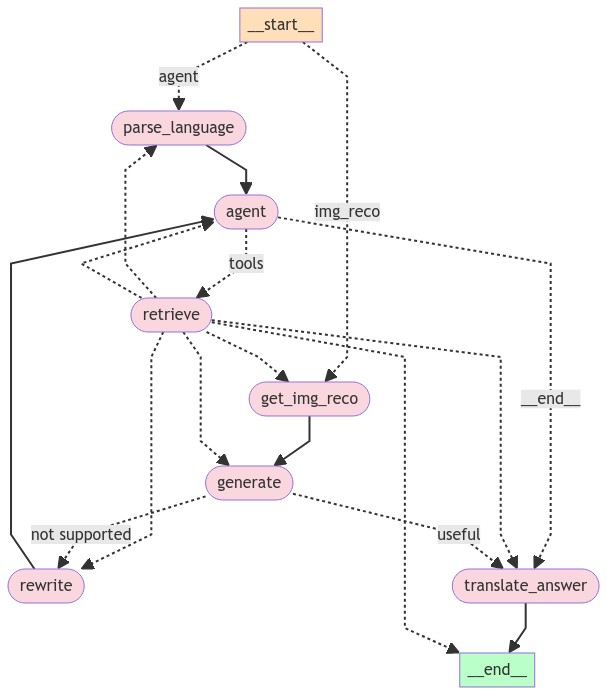

# LangGraph FastAPI POC
An agentic app built using langraph and FastAPI in python

## Agentic Workflow


This code defines an agentic workflow using the langgraph library. The workflow consists of several nodes that perform different tasks, and the flow between these nodes is controlled by conditional edges. Here's a description of the nodes and the overall flow:
1. **decide_img_branch**: This node would decide whether the input is an image or text.
2. **get_img_reco**: If the input is an image, this node performs image recognition.
3. **parse_language**: Parses the input question or text.
4. **agent**: The main agent node that decides whether to retrieve information from tools or generate an answer directly.
5. **retrieve**: A ToolNode that retrieves information from external tools or sources.
6. **rewrite**: Rewrites or reformulates the input question.
7. **generate**: Generates an answer based on the available information.
8. **translate_answer**: Translates the generated answer (if needed).

The workflow starts at the START node and conditionally moves to either parse_language (for text input) or get_img_reco (for image input). If the input is text, it goes through parse_language and then to the agent node.
At the agent node, the workflow decides whether to retrieve information from tools (retrieve node) or generate an answer directly (translate_answer node). If the retrieve node is chosen, the retrieved documents are graded by the grade_documents node.
If the generate node is reached, the generated answer is evaluated by the grade_generation_v_documents_and_question node. If the answer is deemed "not supported," the workflow goes back to the rewrite node to reformulate the question. If the answer is "useful," it proceeds to the translate_answer node.
After the translate_answer node, the workflow reaches the END node, indicating the completion of the process.


## First time setup

1. Install poetry and poetry-dotenv-plugin, run below two commands in the terminal 
``` shell
$ pip install poetry poetry-dotenv-plugin
$ poetry self add poetry-dotenv-plugin
```

2. Go to root of the project and run below coomands. This will install all the needed python packages 
``` shell
$ poetry update
```

3. Paste your secret keys needed to run LLM models in .env file in the root of the project

``` text
# Example content of .env file
GROQ_API_KEY="gsk_gn**"
ANTHROPIC_API_KEY="sk-**"
```

Note you need to change code on line 129, in package unstructured, partition, csv.py in method get_delimiter
``` python
data = "".join(f.readline())
```

4. Run python app using poetry
``` shell
$ poetry run python app.py
```
